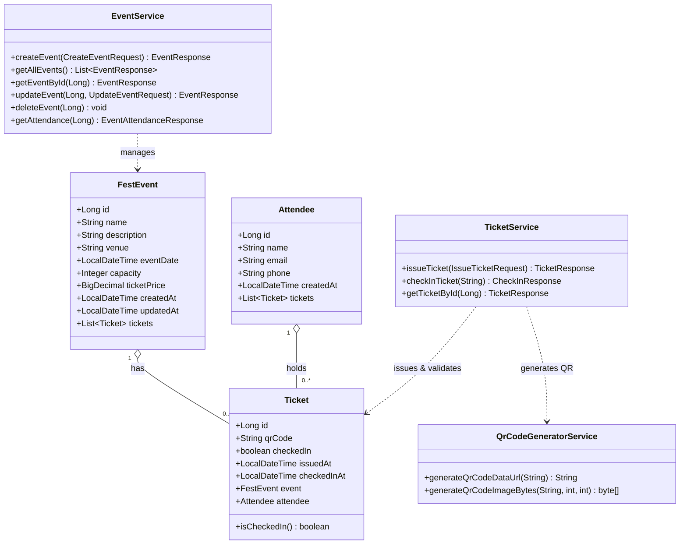

# FestPass — College Fest Ticketing with QR Check-In

A clean, production-grade Spring Boot backend built for college fest management. **FestPass** handles event creation, digital ticket issuance with unguessable QR codes (including ZXing Base64 image generation), one-time entry validation, and real-time attendance tracking against venue capacity.

---

## Table of Contents
1. [System Architecture & UML](#1-system-architecture--uml)
2. [Database Design & Schema](#2-database-design--schema)
3. [Prerequisites & Database Setup](#3-prerequisites--database-setup)
4. [Build and Run Instructions](#4-build-and-run-instructions)
5. [API Specification & Swagger](#5-api-specification--swagger)
6. [Step-by-Step Demo & Verification Cases](#6-step-by-step-demo--verification-cases)
7. [College Viva & Presentation Guide](#7-college-viva--presentation-guide)

---

## 1. System Architecture & UML

### Layered Architecture
The backend strictly adheres to a clean, 5-layer enterprise architecture:
```
┌────────────────────────────────────────────────────────┐
│                   Client Layer                         │
│   (Swagger UI / Postman / QR Scanner / Mobile App)     │
└───────────────────────────┬────────────────────────────┘
                            │ HTTP JSON / REST
┌───────────────────────────▼────────────────────────────┐
│                  Controller Layer                      │
│   EventController  |  TicketController                 │
│   - Route mappings, DTO binding, status codes          │
└───────────────────────────┬────────────────────────────┘
                            │ Validated DTOs
┌───────────────────────────▼────────────────────────────┐
│                   Service Layer                        │
│   EventService  |  TicketService  |  QrCodeGenerator   │
│   - Business rules, atomic transactions (@Transactional)│
│   - Capacity check, QR unguessability, one-time gate  │
└───────────────────────────┬────────────────────────────┘
                            │ Entities
┌───────────────────────────▼────────────────────────────┐
│                 Repository Layer                       │
│   FestEventRepository | AttendeeRepository             │
│   TicketRepository (Spring Data JPA)                   │
└───────────────────────────┬────────────────────────────┘
                            │ SQL / Hibernate
┌───────────────────────────▼────────────────────────────┐
│                  Database Layer                        │
│   MySQL 8.0+ / H2 In-Memory (Test/Dev)                 │
└────────────────────────────────────────────────────────┘
```

### UML Class Diagram



---

## 2. Database Design & Schema

### Tables & Relationships

#### 1. `fest_events`
Stores fest event details, venue limits, and ticket costs.
| Column | Type | Constraints | Description |
|---|---|---|---|
| `id` | `BIGINT` | `PRIMARY KEY AUTO_INCREMENT` | Unique event identifier |
| `name` | `VARCHAR(255)` | `NOT NULL` | Event title |
| `description` | `VARCHAR(1000)` | `NULL` | Event overview |
| `venue` | `VARCHAR(255)` | `NOT NULL` | Auditorium / Stage location |
| `event_date` | `DATETIME(6)` | `NOT NULL` | Event date and start time |
| `capacity` | `INT` | `NOT NULL, CHECK (capacity > 0)` | Maximum allowed attendees |
| `ticket_price` | `DECIMAL(10,2)` | `NOT NULL, CHECK (ticket_price >= 0.0)` | Price per ticket |
| `created_at` | `DATETIME(6)` | `NOT NULL` | Audit timestamp |
| `updated_at` | `DATETIME(6)` | `NULL` | Last modified timestamp |

#### 2. `attendees`
Stores student / attendee profiles.
| Column | Type | Constraints | Description |
|---|---|---|---|
| `id` | `BIGINT` | `PRIMARY KEY AUTO_INCREMENT` | Unique attendee identifier |
| `name` | `VARCHAR(255)` | `NOT NULL` | Attendee full name |
| `email` | `VARCHAR(255)` | `NOT NULL, UNIQUE` | Unique email address |
| `phone` | `VARCHAR(255)` | `NULL` | Contact phone number |
| `created_at` | `DATETIME(6)` | `NOT NULL` | Registration timestamp |

#### 3. `tickets`
Stores issued tickets, unguessable QR tokens, and validation states.
| Column | Type | Constraints | Description |
|---|---|---|---|
| `id` | `BIGINT` | `PRIMARY KEY AUTO_INCREMENT` | Internal primary key |
| `qr_code` | `VARCHAR(64)` | `NOT NULL, UNIQUE, INDEX` | Cryptographically random unguessable token |
| `checked_in` | `BOOLEAN` | `NOT NULL DEFAULT FALSE` | One-time check-in flag |
| `issued_at` | `DATETIME(6)` | `NOT NULL` | Timestamp of ticket issuance |
| `checked_in_at` | `DATETIME(6)` | `NULL` | Timestamp of entry check-in |
| `event_id` | `BIGINT` | `NOT NULL, FOREIGN KEY -> fest_events(id)` | Associated fest event |
| `attendee_id` | `BIGINT` | `NOT NULL, FOREIGN KEY -> attendees(id)` | Associated attendee |

### Database Integrity Rules
1. **Uniqueness**: `qr_code` is indexed with a `UNIQUE` constraint to prevent token collisions.
2. **Foreign Key Integrity**: Tickets strictly require both an existing event and attendee.
3. **Safe Deletion**: An event cannot be deleted if tickets have already been issued (`409 Conflict`), preserving auditing records.
4. **Safe Capacity Updates**: Event capacity cannot be updated to a number lower than the count of tickets already issued (`409 Conflict`).

---

## 3. Prerequisites & Database Setup

### Prerequisites
- **Java**: JDK 17, 21, or higher (tested on OpenJDK / Oracle JDK 21-27).
- **Maven**: Included via `./mvnw` wrapper.
- **Database**: MySQL 8.0+ or MySQL 26.x (running on port `3306`), OR use the built-in zero-config `h2` profile.

### MySQL Database Creation
1. Start your local MySQL server.
2. Connect to MySQL via terminal (`mysql -u root -p`) or MySQL Workbench and run:
   ```sql
   CREATE DATABASE IF NOT EXISTS festpass CHARACTER SET utf8mb4 COLLATE utf8mb4_unicode_ci;
   ```

### Environment Variables Configuration
Spring Boot reads the connection details from environment variables without hardcoding:
- `DB_URL`: Connection string (default: `jdbc:mysql://localhost:3306/festpass?createDatabaseIfNotExist=true&useSSL=false&allowPublicKeyRetrieval=true&serverTimezone=UTC`)
- `DB_USERNAME`: Database user (default: `root`)
- `DB_PASSWORD`: Database password (default: `S5nur@nu02`)

#### Setting Environment Variables

**Windows (PowerShell):**
```powershell
$env:DB_URL="jdbc:mysql://localhost:3306/festpass?createDatabaseIfNotExist=true&useSSL=false&allowPublicKeyRetrieval=true&serverTimezone=UTC"
$env:DB_USERNAME="root"
$env:DB_PASSWORD="S5nur@nu02"
```

**Windows (Command Prompt / CMD):**
```cmd
set DB_URL=jdbc:mysql://localhost:3306/festpass?createDatabaseIfNotExist=true&useSSL=false&allowPublicKeyRetrieval=true&serverTimezone=UTC
set DB_USERNAME=root
set DB_PASSWORD=S5nur@nu02
```

**Linux / macOS (Bash / Zsh):**
```bash
export DB_URL="jdbc:mysql://localhost:3306/festpass?createDatabaseIfNotExist=true&useSSL=false&allowPublicKeyRetrieval=true&serverTimezone=UTC"
export DB_USERNAME="root"
export DB_PASSWORD="S5nur@nu02"
```

**In IDEs (IntelliJ IDEA / Eclipse / VS Code):**
- In **Run/Debug Configurations**, open the **Environment variables** field and add:
  `DB_URL=...;DB_USERNAME=root;DB_PASSWORD=S5nur@nu02`

### JPA Schema Settings (`ddl-auto=update`)
In [`src/main/resources/application.properties`](file:///d:/Festpass-QR%20Check%20In/src/main/resources/application.properties), `spring.jpa.hibernate.ddl-auto` is set to `update`:
- **Why `update`?** On application boot, Hibernate inspects the entities (`FestEvent`, `Attendee`, `Ticket`) and automatically executes `CREATE TABLE` / `ALTER TABLE` if they do not exist or if fields change.
- Unlike `create-drop`, it preserves existing event data and ticket check-in records between application restarts during development and testing.
- Live verified: The application connects to MySQL and creates `attendees`, `fest_events`, and `tickets` tables automatically.


---

## 4. Build and Run Instructions

### 1. Run with MySQL (Default)
```bash
# Windows
.\mvnw.cmd spring-boot:run

# Linux / macOS
./mvnw spring-boot:run
```

### 2. Run with Zero-Config In-Memory H2 Profile
If MySQL is not installed or configured, run with the `h2` profile for immediate evaluation:
```bash
# Windows
.\mvnw.cmd spring-boot:run -Dspring-boot.run.profiles=h2

# Linux / macOS
./mvnw spring-boot:run -Dspring-boot.run.profiles=h2
```
*H2 Web Console is available at `http://localhost:8080/h2-console` (JDBC URL: `jdbc:h2:mem:festpass_db`, User: `sa`, Password: blank).*

### 3. Run Automated Tests
```bash
# Windows
.\mvnw.cmd test

# Linux / macOS
./mvnw test
```
*All 12 automated unit and integration tests run in-memory and will pass without requiring external services.*

---

## 5. API Specification & Swagger

- **Swagger UI Interactive Docs**: [http://localhost:8080/swagger-ui.html](http://localhost:8080/swagger-ui.html)
- **OpenAPI JSON Spec**: [http://localhost:8080/v3/api-docs](http://localhost:8080/v3/api-docs)
- **Postman Collection**: File [`FestPass.postman_collection.json`](file:///d:/Festpass-QR%20Check%20In/FestPass.postman_collection.json) is located in the root directory.

### Endpoint Summary

| Method | Path | Status | Description |
|---|---|---|---|
| `POST` | `/api/events` | `201 Created` | Create new fest event with capacity and pricing |
| `GET` | `/api/events` | `200 OK` | List all events with issued ticket counts |
| `GET` | `/api/events/{id}` | `200 OK` | Get event details by ID (`404` if not found) |
| `PUT` | `/api/events/{id}` | `200 OK` | Update event (`409` if capacity < issued tickets) |
| `DELETE` | `/api/events/{id}` | `204 No Content` | Delete event (`409` if tickets already issued) |
| `GET` | `/api/events/{id}/attendance` | `200 OK` | Get live checked-in headcount vs capacity |
| `POST` | `/api/tickets/issue` | `201 Created` | Issue ticket with QR code (`409` if event is full) |
| `POST` | `/api/tickets/check-in` | `200 OK` | Validate check-in (`404` if unknown, `409` if reused) |
| `GET` | `/api/tickets/{id}` | `200 OK` | Get ticket details and Base64 QR code image |

---

## 6. Step-by-Step Demo & Verification Cases

You can run these curl commands in any terminal (PowerShell or Bash):

### Step 1: Create an Event (Capacity: 2)
```bash
curl -X POST http://localhost:8080/api/events \
  -H "Content-Type: application/json" \
  -d '{
    "name": "Hackathon 2026",
    "description": "24-Hour Codefest",
    "venue": "Campus Block C",
    "eventDate": "2026-10-20T09:00:00",
    "capacity": 2,
    "ticketPrice": 150.00
  }'
```
**Expected Response (201 Created):**
```json
{
  "id": 1,
  "name": "Hackathon 2026",
  "venue": "Campus Block C",
  "capacity": 2,
  "ticketPrice": 150.00,
  "issuedTicketsCount": 0
}
```

### Step 2: Test Validation (Reject Negative Price & 0 Capacity)
```bash
curl -X POST http://localhost:8080/api/events \
  -H "Content-Type: application/json" \
  -d '{"name": "", "venue": "", "capacity": 0, "ticketPrice": -50.00, "eventDate": "2026-10-20T09:00:00"}'
```
**Expected Response (400 Bad Request):**
```json
{
  "status": 400,
  "error": "Validation Failed",
  "validationErrors": {
    "name": "Event name is required",
    "venue": "Event venue is required",
    "capacity": "Capacity must be greater than zero",
    "ticketPrice": "Ticket price cannot be negative"
  }
}
```

### Step 3: Issue Ticket #1 (Success)
```bash
curl -X POST http://localhost:8080/api/tickets/issue \
  -H "Content-Type: application/json" \
  -d '{
    "eventId": 1,
    "attendeeName": "Aarav Kumar",
    "attendeeEmail": "aarav@college.edu",
    "attendeePhone": "+91 9876543210"
  }'
```
**Expected Response (201 Created):**
```json
{
  "ticketId": 1,
  "qrCode": "FP-8f3a9e12-4c22-482f-b472-3c467a549d11",
  "qrCodeImageBase64": "data:image/png;base64,iVBORw0KGgoAAAANSUhEUgAAAPo...",
  "checkedIn": false,
  "eventName": "Hackathon 2026",
  "attendeeName": "Aarav Kumar"
}
```
*(Copy the returned `"qrCode"` for the check-in step below).*

### Step 4: Issue Ticket #2 (Reaches Max Capacity 2/2)
```bash
curl -X POST http://localhost:8080/api/tickets/issue \
  -H "Content-Type: application/json" \
  -d '{
    "eventId": 1,
    "attendeeName": "Diya Sen",
    "attendeeEmail": "diya@college.edu"
  }'
```
**Expected Response (201 Created):** Ticket ID 2 issued.

### Step 5: Reject Ticket #3 when Event is Full (409 Conflict)
```bash
curl -X POST http://localhost:8080/api/tickets/issue \
  -H "Content-Type: application/json" \
  -d '{
    "eventId": 1,
    "attendeeName": "Chetan Sharma",
    "attendeeEmail": "chetan@college.edu"
  }'
```
**Expected Response (409 Conflict):**
```json
{
  "status": 409,
  "error": "Capacity Exceeded",
  "message": "Event 'Hackathon 2026' has reached maximum capacity of 2 tickets. No more tickets can be issued."
}
```

### Step 6: Valid QR Check-In (First Time - 200 OK)
```bash
curl -X POST http://localhost:8080/api/tickets/check-in \
  -H "Content-Type: application/json" \
  -d '{"qrCode": "FP-8f3a9e12-4c22-482f-b472-3c467a549d11"}'
```
**Expected Response (200 OK):**
```json
{
  "message": "Check-in successful! Welcome to Hackathon 2026",
  "ticketId": 1,
  "qrCode": "FP-8f3a9e12-4c22-482f-b472-3c467a549d11",
  "checkedInAt": "2026-09-28T10:45:00.123",
  "attendeeName": "Aarav Kumar",
  "checkedInHeadcount": 1,
  "eventCapacity": 2
}
```

### Step 7: Duplicate QR Check-In Rejection (409 Conflict)
```bash
curl -X POST http://localhost:8080/api/tickets/check-in \
  -H "Content-Type: application/json" \
  -d '{"qrCode": "FP-8f3a9e12-4c22-482f-b472-3c467a549d11"}'
```
**Expected Response (409 Conflict):**
```json
{
  "status": 409,
  "error": "Ticket Already Checked In",
  "message": "Ticket with QR 'FP-8f3a9e12-4c22-482f-b472-3c467a549d11' was already checked in on 2026-09-28T10:45:00.123"
}
```

### Step 8: Unknown QR Check-In Rejection (404 Not Found)
```bash
curl -X POST http://localhost:8080/api/tickets/check-in \
  -H "Content-Type: application/json" \
  -d '{"qrCode": "FP-UNKNOWN-FAKE-CODE"}'
```
**Expected Response (404 Not Found):**
```json
{
  "status": 404,
  "error": "Not Found",
  "message": "Check-in rejected: Unknown QR code 'FP-UNKNOWN-FAKE-CODE'"
}
```

### Step 9: Attendance & Headcount Verification
```bash
curl -X GET http://localhost:8080/api/events/1/attendance
```
**Expected Response (200 OK):**
```json
{
  "eventId": 1,
  "eventName": "Hackathon 2026",
  "capacity": 2,
  "issuedTickets": 2,
  "checkedInHeadcount": 1,
  "remainingCapacity": 0,
  "attendanceRatePercentage": 50.0
}
```

### Step 10: Safe Event Update & Deletion Guards
1. **Capacity Reduction Blocked**:
   ```bash
   curl -X PUT http://localhost:8080/api/events/1 \
     -H "Content-Type: application/json" \
     -d '{"capacity": 1}'
   ```
   **Response (409 Conflict):** `"Cannot reduce event capacity to 1 because 2 tickets have already been issued"`.

2. **Deletion Blocked When Tickets Exist**:
   ```bash
   curl -X DELETE http://localhost:8080/api/events/1
   ```
   **Response (409 Conflict):** `"Cannot delete event 'Hackathon 2026' (ID: 1) because 2 ticket(s) have already been issued for it."`.

---

## 7. College Viva & Presentation Guide

### Key Viva Questions & Clear Answers

#### Q1: Why did you separate DTOs from JPA Entities?
> **Answer**: Returning JPA entities directly causes circular references during JSON serialization (e.g. `Event` -> `Tickets` -> `Event`), leaks database implementation details, and exposes internal tables to clients. DTOs decouple the database schema from the API contract and allow validation annotations (`@NotBlank`, `@Positive`) without polluting database entity definitions.

#### Q2: How did you ensure QR codes cannot be guessed or forged?
> **Answer**: Instead of using predictable sequential primary keys (`ticket_id=1, 2, 3`), FestPass generates a random, cryptographically strong UUID (`FP-` + `UUID.randomUUID()`). Even if an attacker knows ticket #1 was issued, they cannot guess any other attendee's QR code.

#### Q3: How do you prevent capacity overflow when multiple users buy tickets at once?
> **Answer**: In `TicketService.issueTicket()`, both the capacity check (`countByEventId`) and ticket creation are executed inside an atomic `@Transactional` service boundary. If `issuedTickets >= capacity`, an explicit `CapacityExceededException` is thrown and the transaction rolls back before any record is persisted.

#### Q4: How is one-time check-in strictly enforced?
> **Answer**: Each `Ticket` record has a boolean `checkedIn` flag and a `checkedInAt` timestamp. When `checkInTicket()` is called, the ticket is fetched by its indexed unique `qrCode`. If `checkedIn == true`, the service immediately aborts with `TicketAlreadyCheckedInException` (HTTP 409 Conflict), displaying the original check-in timestamp.

#### Q5: What is the difference between "Issued Tickets" and "Headcount"?
> **Answer**: 
> - **Issued Tickets** = Total tickets sold/reserved (`countByEventId`), which must never exceed event capacity.
> - **Headcount** = Attendees who have physically arrived and scanned their QR code at entry (`countByEventIdAndCheckedInTrue`). This distinction is vital for safety, real-time venue crowd monitoring, and no-show tracking.

#### Q6: How are errors handled across the API?
> **Answer**: We implemented a centralized `GlobalExceptionHandler` with `@RestControllerAdvice`. Instead of letting unhandled runtime exceptions expose internal Java stack traces to clients, it intercepts exceptions and converts them into standardized, clean JSON responses with RFC-compliant HTTP status codes (`400`, `404`, `409`, `500`).
